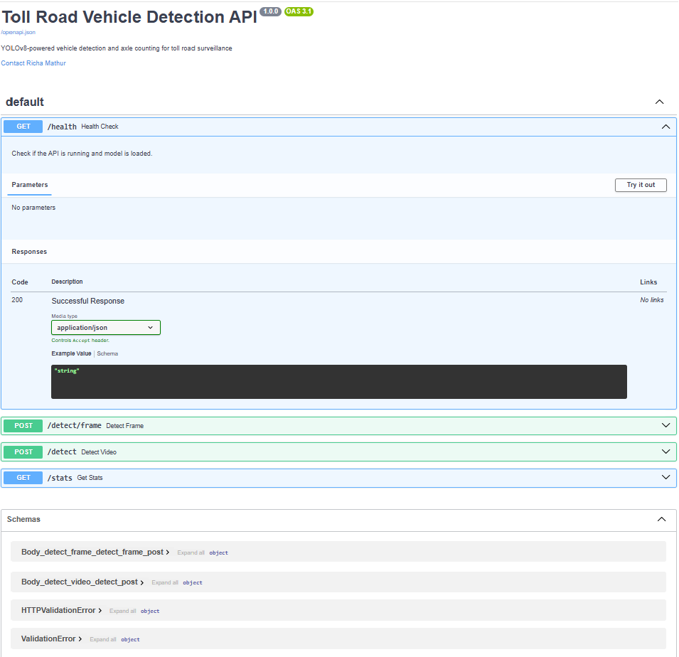
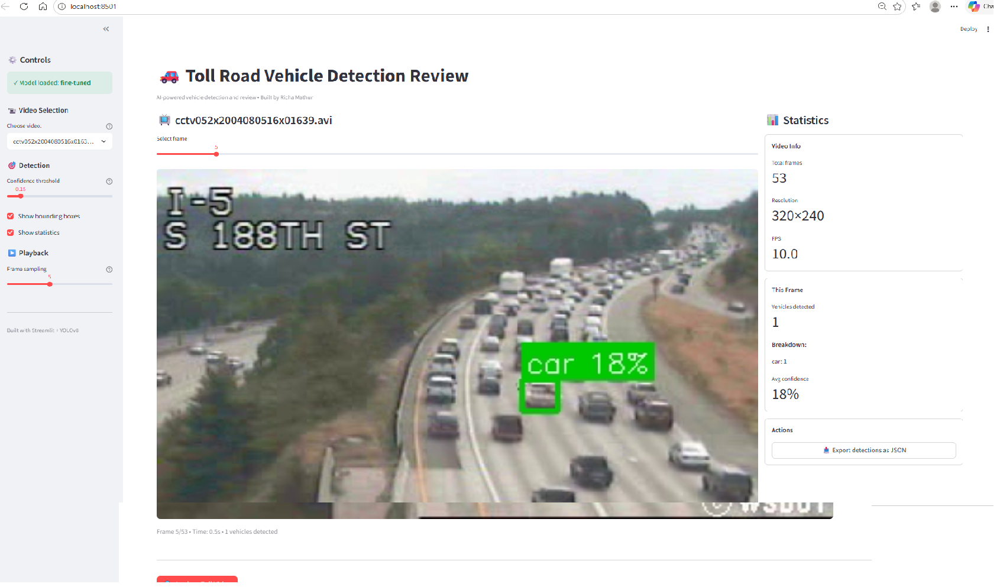
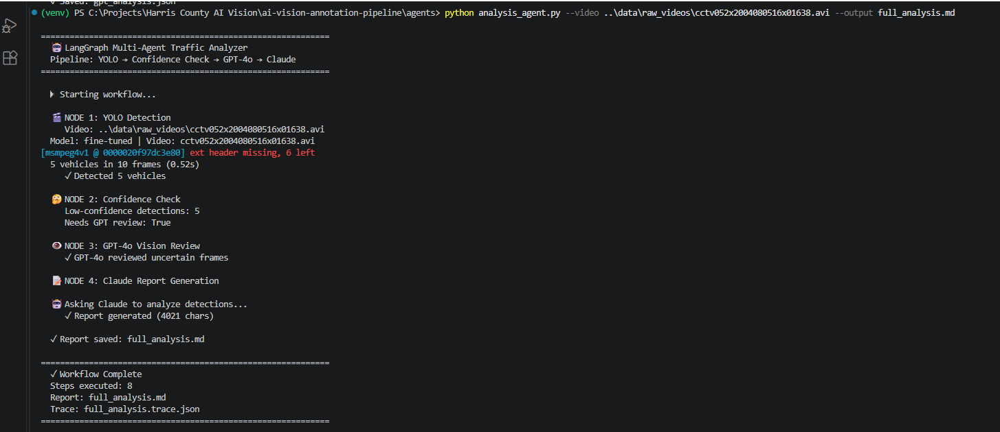

# AI Vision Annotation Pipeline

**End-to-end AI system for vehicle detection, axle counting & traffic analysis**

Full ML pipeline combining Computer Vision (YOLOv8) with LLM-powered analysis (Claude, GPT-4o) orchestrated via LangGraph. Built by [Richa Mathur](https://linkedin.com/in/richamathurr).

    

---

## 🎯 Overview

Automated vehicle detection and traffic analysis system for toll road surveillance. Demonstrates the complete ML lifecycle from raw video to deployed multi-agent AI pipeline.

**Key capabilities:**
- Automated vehicle detection (car, truck, bus, motorcycle)
- Axle count estimation for toll classification
- Multi-model AI orchestration (YOLO + GPT-4o + Claude)
- REST API deployment with FastAPI
- Interactive review dashboard with Streamlit

---

## 🏗️ Architecture

```
Raw Videos → ffmpeg → MP4 → Auto-Annotation (YOLOv8)
                                    ↓
                            COCO JSON → YOLO labels
                                    ↓
                            Fine-Tuning (30 epochs) → best.pt (80.6% mAP)
                                    ↓
                            FastAPI REST Endpoint
                                    ↓
                    LangGraph Multi-Agent Pipeline
                    ├── YOLO Detection
                    ├── Confidence Routing
                    ├── GPT-4o Vision (edge cases)
                    └── Claude Analysis (reports)
                                    ↓
                            Streamlit Dashboard
```

---

## 📊 Model Performance

Trained YOLOv8n on 118 images (30 epochs, CPU ~5 minutes):

| Class | mAP50 | Precision | Recall |
|-------|-------|-----------|--------|
| **All** | **80.6%** | 72.5% | 85.7% |
| Car | 97.7% | 91.4% | 97.2% |
| Bus | 96.2% | 76.2% | 90.0% |
| Truck | 48.1% | 50.0% | 70.0% |

*Truck mAP lower due to class imbalance (6 truck samples vs 26 cars in validation). Addressable with data augmentation and active learning.*

**Dataset:** Publicly available traffic CCTV footage from Kaggle Highway Traffic Videos Dataset.

---

## 🚀 Quick Start

### Prerequisites
- Python 3.10+
- 8GB RAM minimum
- Optional: GPU for faster training

### Installation

```bash
# Clone the repo
git clone https://github.com/richamathur-flex/ai-vision-annotation-pipeline.git
cd ai-vision-annotation-pipeline

# Create virtual environment
python -m venv venv
source venv/bin/activate  # Windows: venv\Scripts\activate

# Install dependencies
pip install -r requirements.txt

# Set up environment variables
cp env.example .env
# Edit .env and add your Claude + OpenAI API keys
```

### Run the Pipeline

```bash
# 1. Auto-annotate videos (YOLOv8 detects vehicles → COCO JSON)
python scripts/auto_annotate.py --video-dir data/raw_videos/ --all

# 2. Train custom YOLOv8 model
cd models && python train_yolo.py

# 3. Start the detection API
cd inference && python api.py
# Open http://localhost:8000/docs for Swagger UI

# 4. Generate traffic reports with Claude
cd agents && python claude_analyzer.py --input ../inference/results.json

# 5. Run the full multi-agent pipeline
python analysis_agent.py --video ../data/raw_videos/sample.avi

# 6. Launch the Streamlit review app
cd app && streamlit run video_review.py
```

---

## 📁 Project Structure

```
ai-vision-annotation-pipeline/
├── scripts/
│   ├── auto_annotate.py       # YOLOv8 → COCO JSON
│   └── coco_to_yolo.py        # Format converter
├── models/
│   ├── train_yolo.py          # Fine-tune YOLOv8
│   └── weights/best.pt        # Trained model (gitignored)
├── inference/
│   ├── api.py                 # FastAPI REST endpoint
│   ├── detect.py              # CLI detection
│   └── draw_boxes.py          # Bounding box overlays
├── agents/
│   ├── claude_analyzer.py     # Claude → traffic reports
│   ├── gpt_vision_fallback.py # GPT-4o → edge cases
│   └── analysis_agent.py      # LangGraph orchestration
├── app/
│   ├── video_review.py        # Streamlit video review
│   └── dashboard.py           # Metrics dashboard
├── data/
│   ├── raw_videos/            # Input videos (gitignored)
│   ├── annotations/           # COCO JSON output
│   └── sample_frames/         # Annotated frames
├── docs/                      # Architecture guides
├── tests/                     # Unit tests
├── requirements.txt
├── env.example
└── .gitignore
```

---

## 🛠️ Tech Stack

**Computer Vision:** YOLOv8, OpenCV, ffmpeg  
**LLMs:** Anthropic Claude, OpenAI GPT-4o Vision  
**Orchestration:** LangGraph, LangChain  
**API:** FastAPI, Uvicorn  
**UI:** Streamlit, Plotly  
**Annotation:** CVAT (for manual review)  
**DevOps:** Docker, Git  

---

## 🧠 How the Multi-Agent Pipeline Works

The LangGraph workflow has four nodes with conditional routing:

1. **YOLO Detection** — Fast CV model runs on video frames, outputs bounding boxes and confidence scores
2. **Confidence Check** — Routing node: if any detection has confidence <0.5, flag for GPT-4o review
3. **GPT-4o Vision (conditional)** — Only invoked for low-confidence frames. Provides second opinion with reasoning about occlusion, lane position, and axle counts
4. **Claude Analysis** — Synthesizes YOLO detections + GPT-4o context into structured natural language traffic report

This pattern combines the **speed of CV models** with the **reasoning of LLMs** — each model used where it excels.

---

## 🎓 Key Learnings

1. **Training data quality > model complexity** — 148 well-annotated images produced strong results (80.6% mAP)
2. **Multi-model orchestration beats single models** — YOLO's speed + GPT-4o's reasoning is better than either alone  
3. **Human-in-the-loop automation** — Auto-annotation with conditional review is a production-grade pattern
4. **Deployment matters** — A model sitting in a notebook is useless. FastAPI + Streamlit makes it real

---

## 📸 Screenshots

### FastAPI Auto-Generated Documentation


### Streamlit Interactive Review App


### LangGraph Multi-Agent Pipeline Output


---

## 🔮 Future Enhancements

- **Docker containerization** for portable deployment
- **MLflow integration** for experiment tracking
- **Active learning loop** — route low-confidence GPT-4o labels back for model retraining
- **Vector store integration** (Pinecone/Weaviate) for similar-frame retrieval
- **Multi-camera aggregation** for regional traffic analytics

---

## 👤 About

**Richa Mathur** — AI Engineer specializing in Agentic AI, Computer Vision, and Cloud Solutions  
📧 richa.agenticai@gmail.com  
💼 [LinkedIn](https://linkedin.com/in/richamathurr)  
📍 Dallas, TX

---

## 📄 License

MIT License — see [LICENSE](LICENSE) file

---

*Built to demonstrate the full lifecycle of modern AI engineering: from raw data to annotated datasets to trained models to deployed APIs to intelligent multi-agent pipelines.*
